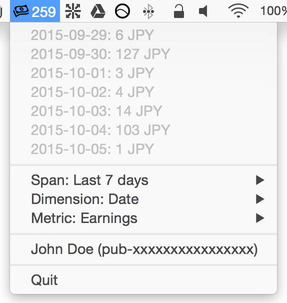

# AdSense Report Menubar

Your AdSense performance report on the menubar.

## Screenshot

(Values are dummies)

## Compilation

    npm install
    npm run setup-dev
    npm run compile
    npm run app

## How To Use

At first startup, select the 'Authorize...' menu to authorize the "AdSense Report Menubar" on your browser. Copy the authentication code shown on the final page and paste it on the authorization form shown.

You can configure three items on the menu:

 * **Span**: Today, Last 7 days or Last 1 month.
 * **Dimension**: Ad Unit or Date.
 * **Metric**: Clicks, Earnings or Pageviews.

The number shown on the menubar is the total ammount of the selected metric along the span.

You can see each metric values of the selected dimension on the menu shown by clicking the menubar icon.

## Author

motemen <https://github.com/motemen>
